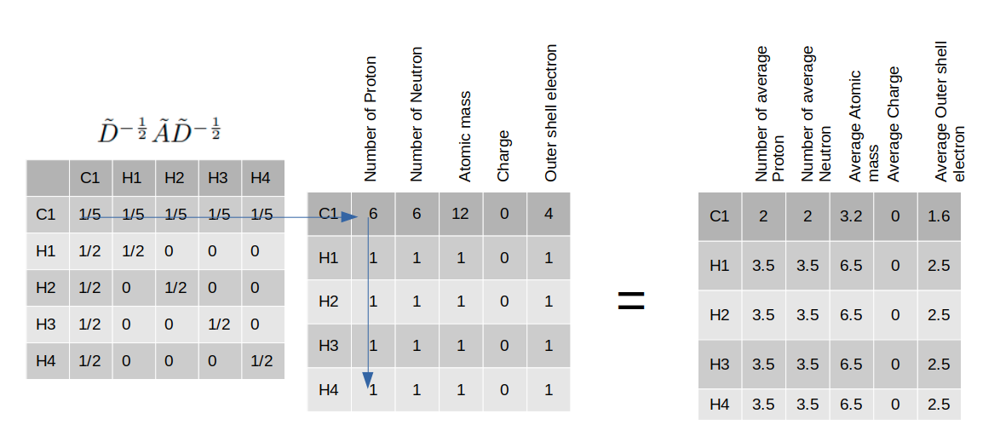

# Graph Convolutional Network using pytorch-geometric

Graph convolutional networks are in general known as message passing network. They are used generally in a graph G(V,E) where nodes or vertices are properly connected with each other and the connections are shown by node edges just like below figure.

<p align="center">
  
</p>

A very popular and easy to understand example would be a chemical molecule where each atom is considered as a node and the chemical bonds are considered as edges.
<p align="center">
  
</p>

In Graph Neural Networks, there are two types of features involved.

1. Node features: This type of features describe the characteristics of a node. So, each node is represented by its corresponding node feature. For the molecular example, the node feature space may contain atomic number, atomic mass, number of electrons, charge value, chiral center or not etc. information regarding an atom.
2. Edge features: The connection between two atoms are represented by edge feature. In a plain graph G(V,E), this edge feature might just be a 1/0 value indicating the connection is present or not. But in molecular example, it might express more information like the type of the bond between two atoms, explicit bond information in a multi-dimensional feature space.

There is also another term named as 'Adjacency Matrix' which represents the connection of nodes in a matrix format. For example, if we have a molecule of methane CH4, we can construct a matrix of size 5x5 to indicate the connection between each pair of atoms.
<p align="center">
  
</p>

The corresponding node features may be represented by this table-
<p align="center">
  
</p>


# Processing formula

This is the node processing formula for a Graph Convolutional Network
<p align="center">
  
</p>

A few things happening here all at once
1. This equation is multiplying adjacency matrix with the feature vectors of connected nodes only.
2. The identity matrix added to the adjacency matrix is adding extra 1 at all diagonal entries so that during multiplication of step-1, the features of node itself are also considered.
  <p align="center">
    
  </p>
3. The Matrix D is degree matrix which is basically doing average operation to scale down the feature calculation. Its making the feature calculation robust against the effect of number of connected nodes. Otherwise, if one node is connected to just another node, its feature value would be lower than the node which is connected to multiple nodes.
  
  (Note: For simplicity, square root calculation of degree matrix was neglected)
  <p align="center">
    
  </p>
4. The weight matrix is being multiplied to find a new representation vector of the current node.

This computation will be applied to all nodes of the graph. Finally, we can get new node feature vectors for all nodes
  <p align="center">
    
  </p>


# Edge features
So far, we have seen only the representation of node features. But, edge feature is also important information in a Graph. Edge feature is already used in above calculation inside the adjacency matrix where we put one to show node connections. But in a generalized way, this computation can be modified by introducing decimal values instead of putting exact 1. This way, we can show how strong the connection/bond is between two nodes.

But, it needs more generalization. Lets assume, we have a molecule of CH3-CH2-OH where there are different types ob bonds such as C-C bond, C-H bond, H-H bond, C=O bond etc. S, to represent these different types of bonds we need to introduce one hot vectors. So, now we can not accommodate all values of these bond type feature inside the adjacency matrix. So, directly Graph Convolution can not be applied using edge features. 
  <p align="center">
    
  </p>

# General Message Passing formula
  <p align="center">
    
  </p>

A few things are happening in this equation to process the features of node $X_i$-

1. concatenate node features of two node ends ($X_i$, $X_j$) where $X_j$ is feature of a neighboring node of $X_i$ and edge features $e_{ij}$ together 
2. process the combined features through a Fully connected (Linear/Dense) 
3. repeat this for all neighboring nodes of $X_i$
4. get average/sum or any other pooling mechanism to get a feature vector from all the neighboring features
5. concatenate the processed feature with the actual node feature of $X_i$
6. process with another fully connected layer to get final feature representation of the node feature of $X_i$

According to the implementation available on torch_geometric library, they do not allow edge feature processing in GCN layer. That's why in the code, I used Graph Attention network to process edge features.


# Representations in torch_geometric

In torch_geometric, the molecule methane will be explained by a graph and to construct the graph, we need ot define the nodes and their connections.

We can do it this way-
- Lets define indices of the atoms as 0, 1, 2, 3, 4 for C, H1, H2, H3, H4 respectively
- Define the edges in a 10x2 matrix (10x2 because for each edge, there will be 2 node indices and for undirected edge, we have to define it both way (i, j) and (j, i))
- Define the features in a 5x5 matrix (5 atoms, 5 features)
- Use torch_geometric.data.Data class for these definitions

We can look at the piece of the code below to do that-
```
# definition of methane
# CH4
edge_index = torch.tensor(
    [[0, 1], [1, 0],
     [0, 2], [2, 0],
     [0, 3], [3, 0],
     [0, 4], [4, 0]], dtype=torch.long)

# description of features
# #proton, #neutron, atomic mass, charge, outer shell electrons
x = torch.tensor(
    [[6, 6, 12, 0, 4],
     [1, 1, 1, 0, 1],
     [1, 1, 1, 0, 1],
     [1, 1, 1, 0, 1],
     [1, 1, 1, 0, 1]], dtype=torch.float)
```


# Example problem (Graph level prediction: Energy prediction of a molecule)
molecular Energy prediction from molecular graph. Label was provided an energy values for each molecule in the data set. As energy values are decimal values, regression model was used to predict.

## Data collection
data is downloaded from kaggle website (https://www.kaggle.com/c/champs-scalar-coupling)

## Data pre-processing
- Node and edge features were extracted from the molecular structures.
- For each node, I have calculated these features- ['proton', 'neutron', 'mass', 'outer_electron', 'outer_electron_def', 'total_shell']
- For each edge/bond, bond-type feature was provided in the dataset. So, it was used in one-hot encoded format. atomic distance between two atoms inside a molecule was also provided. This was another edge feature. The last edge feature was scalar-coupling-constant value provided in the training data only (this is the main label of the kaggle competition). 
- Only training data from the provided kaggle data set was used for train, validation and test.
- Provided training data was split into 70-15-15 split.
- Data processing takes much time. So, its suggested to run the script 'src/prepare_data.py' separately
- After that, training and evaluation can be done using 'src/train.py'

## Code compilation
1. Prepare a virtual environment and install all necessary libraries from requirements.txt
(if you face issues regarding installation of torch_geometric, please refer here- https://pytorch-geometric.readthedocs.io/en/latest/install/installation.html)
2. Check system requirements of pytorch from https://pytorch.org/ and install pytorch properly
3. Download data from kaggle and set parameters in config.py properly including the data directory path
4. open terminal from this directory where README.md is kept and run the command ```python src/prepare_data.py```
5. run training using the command ```python src/train.py```

## Results
  <p align="center">
    
  </p>
  <p align="center">
    
  </p>

Note that the modeling was done for demonstration purposes only. So, the results are not very impressive.


# Resources and references:
- RDKIT webpage: https://www.rdkit.org/docs/GettingStartedInPython.html
- Torch-geometric webpages:
  - Installation: https://pytorch-geometric.readthedocs.io/en/latest/install/installation.html
  - Introduction: https://pytorch-geometric.readthedocs.io/en/latest/get_started/introduction.html
  - Data class: https://pytorch-geometric.readthedocs.io/en/latest/generated/torch_geometric.data.Data.html#torch_geometric.data.Data
  - DataLoader: https://pytorch-geometric.readthedocs.io/en/latest/modules/loader.html
- Youtube explanatory example: https://www.youtube.com/watch?v=VXFFHHoE1wk
- Github explanatory example: https://github.com/masashitsubaki/molecularGNN_smiles
- Dataset links:
  - https://pytorch-geometric.readthedocs.io/en/latest/cheatsheet/data_cheatsheet.html
  - https://chrsmrrs.github.io/datasets/docs/datasets/
- Edge prediction and edge feature utilization:
  - https://github.com/pyg-team/pytorch_geometric/discussions/4831
- initial idea of graph convolution ad message passing (https://arxiv.org/abs/1509.09292)
- Neural Message Passing Network paper (https://arxiv.org/abs/1704.01212v2)
- Graph Convolutional Network paper (https://arxiv.org/abs/1609.02907)
- Graph Attention Network paper (https://arxiv.org/abs/1710.10903)
- Mathematical expressions in markdown (https://rpruim.github.io/s341/S19/from-class/MathinRmd.html)